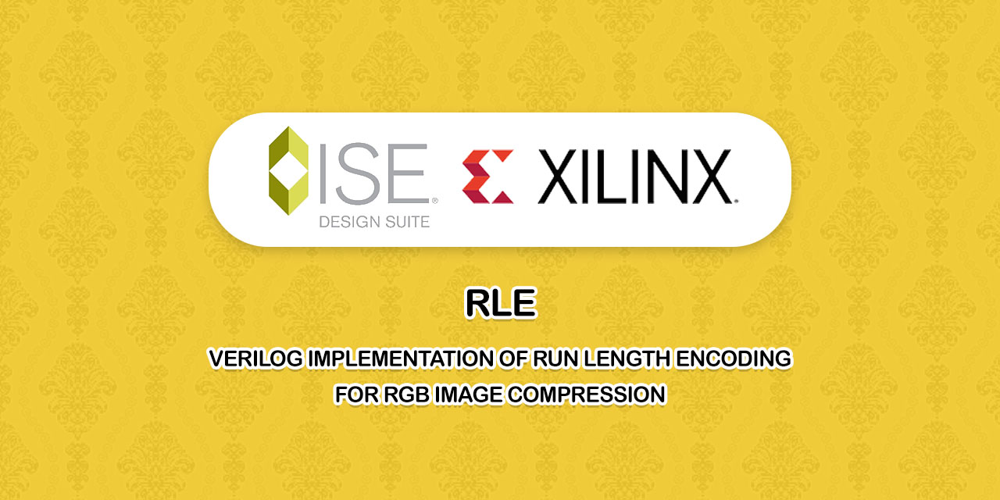

# RLE

Verilog Implementation of Run Length Encoding for RGB Image Compression

## Reference
[Varsha Bansal, Pratishtha Gupta, Suhail Tomar, "The Implementation of Run Length Encoding for RGB Image Compression" International Journal of Advanced Research in Computer Engineering & Technology (IJARCET) Volume 3 Issue 12, December 2014](docs/reference-paper.pdf)

## Author
**Rabist** - view on [LinkedIn](https://www.linkedin.com/in/rabist)

## Details
- **Course:** Computer-Aided Design of Digital Systems - Undergraduate
- **Teacher:** [Dr. Hadi Safdarkhani](https://www.linkedin.com/in/hadi-safdarkhani-046a437a)
- **Univ:** Yazd University
- **Semester:** Spring 1399

## License
Licensed under [MIT](LICENSE).
